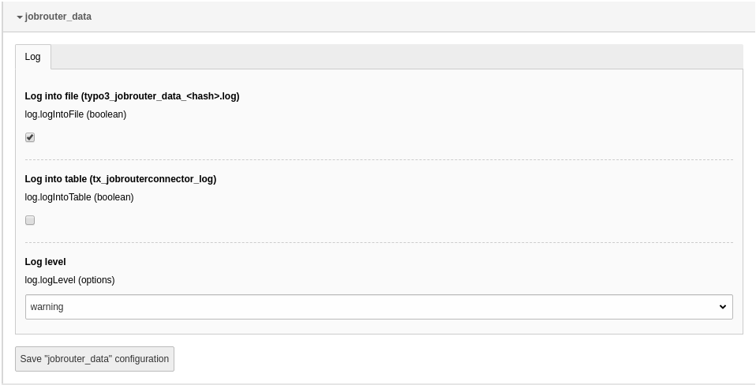

.. include:: _includes.rst.txt

.. highlight:: typoscript

.. _configuration:

=============
Configuration
=============

Target group: **Administrators**

.. _configuration-extension:

Extension configuration
=======================

.. deprecated:: 0.14.0
   The configuration of logging is deprecated and will be removed in the next
   major version 0.15.0 or 1.0.0. :ref:`Configure the required log writers
   <configuration-logging>` in your site package instead.

To configure the extension, go to :guilabel:`Admin Tools` > :guilabel:`Settings`
> :guilabel:`Extension Configuration` and click on the :guilabel:`Configure
extensions` button. Open the :guilabel:`jobrouter_data` configuration:

   Options in the extension configuration

Log
---

Log into file
~~~~~~~~~~~~~

If this option is activated, the log output is written to the file
:file:`var/log/typo3_jobrouter_data_<hash>.log` (for Composer-based
installations). It is enabled by default.

Log into table
~~~~~~~~~~~~~~

Activate this option to log into the table `tx_jobrouterbase_log`. It is
disabled by default.

.. hint::
   To display the log entries of this table in the TYPO3 backend, install the
   extension `co-stack/logs`_.

Log level
~~~~~~~~~

Using the drop down menu you can select the log level for the activated log
options. :guilabel:`warning` is selected by default.

.. _configuration-logging:

Logging
=======

If logging is necessary to track synchronisations and possible warnings or
errors, you can set up :ref:`log writers <t3api:logging-writers>` depending on
your needs.

**Example:** To log all warnings and higher levels of this extension into a
file, add this snippet to the :file:`ext_localconf.php` file of your site
package extension:

.. code-block:: php

   $GLOBALS['TYPO3_CONF_VARS']['LOG']['Brotkrueml']['JobRouterData']['writerConfiguration'][\Psr\Log\Level::WARNING] = [
      \TYPO3\CMS\Core\Log\Writer\FileWriter::class => [
         'logFileInfix' => 'jobrouter_data'
      ]
   ];

The messages are then written to the
:file:`var/log/typo3_jobrouter_data_<hash>.log` file.

.. _configuration-content-element:

Content element
===============

It is possible to adjust the CSS classes of the :ref:`content element
<editor-content-element>` table via TypoScript::

   tt_content.tx_jobrouterdata_table {
      settings {
         cssClasses {
            # The class of the table tag
            table = ce-table

            # The class of table cells which should be aligned left
            left = ce-align-left

            # The class of table cells which should be aligned centered
            center = ce-align-center

            # The class of table cells which should be aligned right
            right = ce-align-right
         }
      }
   }

The alignment is selected when configuring the :ref:`table columns
<module-create-table-link-simple>`.

.. _co-stack/logs: https://extensions.typo3.org/extension/logs
