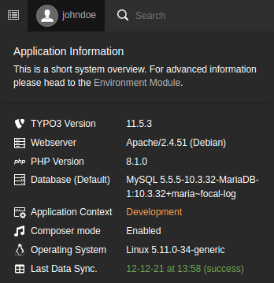

.. include:: _includes.txt

.. highlight:: shell

.. _configuration:

=============
Configuration
=============

Target group: **Administrators**

.. _configuration-extension:

Extension Configuration
=======================

To configure the extension, go to :guilabel:`Admin Tools` > :guilabel:`Settings`
> :guilabel:`Extension Configuration` and click on the :guilabel:`Configure
extensions` button. Open the :guilabel:`jobrouter_data` configuration:

.. figure:: _images/extension-configuration.png
   :alt: Options in the extension configuration

   Options in the extension configuration

log.logIntoFile
---------------

If this option is activated, the log output is written to the file
:file:`var/log/typo3_jobrouter_data_<hash>.log` (for Composer-based
installations). It is enabled by default.

log.logIntoTable
----------------

Activate this option to log into the table `tx_jobrouterconnector_log`. It is
disabled by default.

.. hint::

   To display the log entries of this table in the TYPO3 backend, install the
   extension `vertexvaar/logs <https://github.com/vertexvaar/logs>`_.

log.logLevel
------------

Using the drop down menu you can select the log level for the activated log
options. :guilabel:`warning` is selected by default.

.. _configuration-templates:

Templates
=========

It is possible to adjust the layout of the :ref:`content element
<editor-content-element>` table. By default the layout from the
core content element `Table` is used.

If you want to use other classes, you have to override the template. Just
copy the template file
:file:`Resources/Private/Template/ContentElement/Table.html` into your own
site package extension and add the path via TypoScript, e.g.:

.. code-block:: typoscript

   tt_content.tx_jobrouterdata_table {
      templateRootPaths.10 = EXT:your_extension/Resources/Private/Template/JobRouterData/
   }

.. _configuration-commands:

Commands
========

Surely you want to execute the commands regularly. Simply set up cron jobs that
will execute the commands regularly, e.g. once an hour or once a day, depending
on your needs.

.. _configuration-sync-command:

Synchronising tables
--------------------

To synchronise the tables from JobRouter installations in TYPO3 a command is
available. Run the following command in the project directory:

::

   vendor/bin/typo3 jobrouter:data:sync

Hopefully you will receive a successful response:

::

   [OK] 2 table(s) synchronised successfully

You can also synchronise just one table:

::

   vendor/bin/typo3 jobrouter:data:sync 1

Where `1` is the uid of the table.

If an error occurs, the command issues a warning:

::

   [WARNING] 1 out of 2 table(s) had errors on synchronisation

Other synchronisations are not affected by an error in one synchronisation.
According to your :ref:`logging configuration <configuration-extension>`, the
error is also logged.

.. note::

   Only one synchronisation can run at a time. If a synchronisation starts while
   another is in progress, the second synchronisation is terminated and a
   warning is displayed.

The last run of the command is shown in the system information toolbar
(:guilabel:`Last Data Sync.`):

   System information with last run of the sync command

.. _configuration-transmit-command:

Transmitting Data Sets
----------------------

If you use the :ref:`transfer table <developer-transfer-data-sets>` to transmit
JobData data sets to a JobRouter installation must also use the transmit
command:

::

   vendor/bin/typo3 jobrouter:data:transmit

In general you should receive a successful answer:

::

   [OK] 13 transfer(s) transmitted successfully

If an error occurs, the command issues a warning:

::

   [WARNING] 2 out of 6 transfer(s) had errors on transmission

Other transmissions are not affected by an error in one transmission. According
to your :ref:`logging configuration <configuration-extension>`, the error is
also logged.

.. note::

   Only one transmission can run at a time. If a transmission starts while
   another is in progress, the second transmission is terminated and a warning
   is displayed.

The last run of the command is shown in the system information toolbar
(:guilabel:`Last Data Transmiss.`):

.. figure:: _images/system-information-transmit.png
   :alt: System information with last run of the transmit command

   System information with last run of the transmit command

.. _configuration-deleteoldtransfers-command:

Delete Old Transfers
--------------------

After successfully transmitting data sets from the transfer table, these
transfers are marked as successful. They may contain sensitive data and should
be deleted regularly. A command is available for this task:

::

   vendor/bin/typo3 jobrouter:data:deleteoldtransfers

In general you should receive a successful answer:

::

   [OK] 23 successful transfers older than 30 days deleted

By default, successful transfer records that are older than 30 days are deleted.
You can adjust this value by adding an argument to the command:

::

   vendor/bin/typo3 jobrouter:data:deleteoldtransfers 7

Now successful transfer records that are older than seven days are deleted. If
you use `0` as argument, all successful transfers are deleted.

Erroneous transfers are not deleted and should be handled manually.

.. note::

   If there were deleted successful transfer records, the number of affected
   rows is logged as *notice*, if there were none it is logged as *info*.
