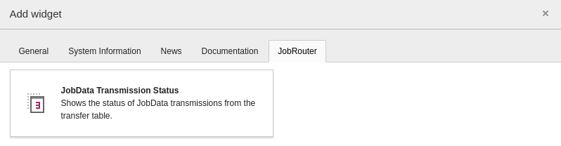
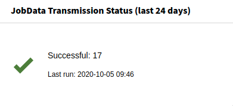

.. include:: _includes.txt

.. _dashboard-widgets:

=================
Dashboard widgets
=================

Target group: **Editors, Integrators, Administrators**

.. contents:: Table of Contents
   :depth: 1
   :local:

With the `Dashboard <https://docs.typo3.org/c/typo3/cms-dashboard/master/en-us/>`_
system extension installed, some widgets can be used for statistics. You can
find them in the :guilabel:`Add widget` wizard on the
:guilabel:`JobRouter` tab:

   Add JobRouter widgets

The widgets are based on the transfer table. All entries are considered -
successfully started, pending and erroneous entries.

.. note::

   The available widgets depend on the access rights of user.

JobData transmission status
===========================

The status of the JobData transmissions can be shown with this widget:

   JobData Transmission Status widget
