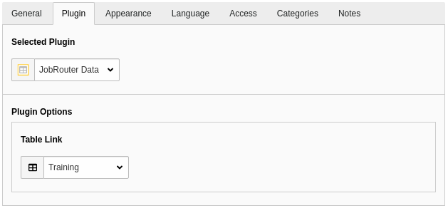
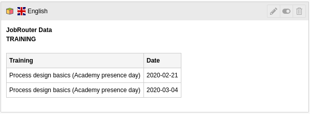

.. include:: _includes.txt

.. _editor:

===========
For Editors
===========

Target group: **Editors**

.. _editor-plugin:

Plugin
======

Content of JobData tables that are synchronised with the :ref:`simple type
<usage-create-table-link-simple>` can be easily displayed on the website
with a plugin.

Go to the :guilabel:`Web` > :guilabel:`Page` module and select the desired page
in the page tree. Click on :guilabel:`+ Content` in the column and position you
want to insert. To add the plugin, select the :guilabel:`Plugin` tab
in the :guilabel:`Create new content element` wizard and click on the
:guilabel:`JobRouter Data` element:

.. figure:: _images/content-element-wizard.png
   :alt: Content element wizard

   Content element wizard

In the following form, click on the :guilabel:`Plugin` tab and select the
desired table link:

   Plugin configuration

After saving the content element, a preview section is displayed:

   Preview snippet

