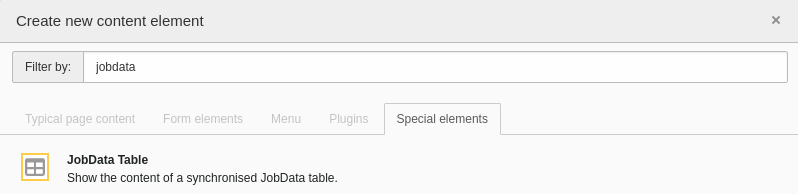

.. include:: _includes.rst.txt

.. _editor:

===========
For editors
===========

Target group: **Editors**

.. _editor-content-element:

Content element
===============

.. caution::
   The content element is considered experimental. It can change in the next
   major releases!

Content of JobData tables that are synchronised with the :ref:`simple type
<module-create-table-link-simple>` can be easily displayed on the website
with the content element `JobData Table`.

Go to the :guilabel:`Web` > :guilabel:`Page` module and select the desired page
in the page tree. Click on :guilabel:`+ Content` in the column and position you
want to insert. To add the content element, select the :guilabel:`Special
elements` tab in the :guilabel:`Create new content element` wizard and click on
the :guilabel:`JobData Table` element:

   Content element wizard

In the following form, click on the :guilabel:`Table` tab and select the
desired table link:

.. figure:: _images/content-element-configuration.png
   :alt: Content element configuration

   Content element configuration

After saving the element, a preview section is displayed:

.. figure:: _images/content-element-preview.png
   :alt: Preview of the content element

   Preview of the content element

Switch to the web page to see the content of the table displayed:

.. figure:: _images/content-element-frontend.png
   :alt: Content of the table on the web page

   Content of the table on the web page

.. hint::
   The formatting of the content in the table is customised to match the page's
   locale (date and numbers). It can be customized by a developer, see section
   :ref:`customise-column-formatting`.
