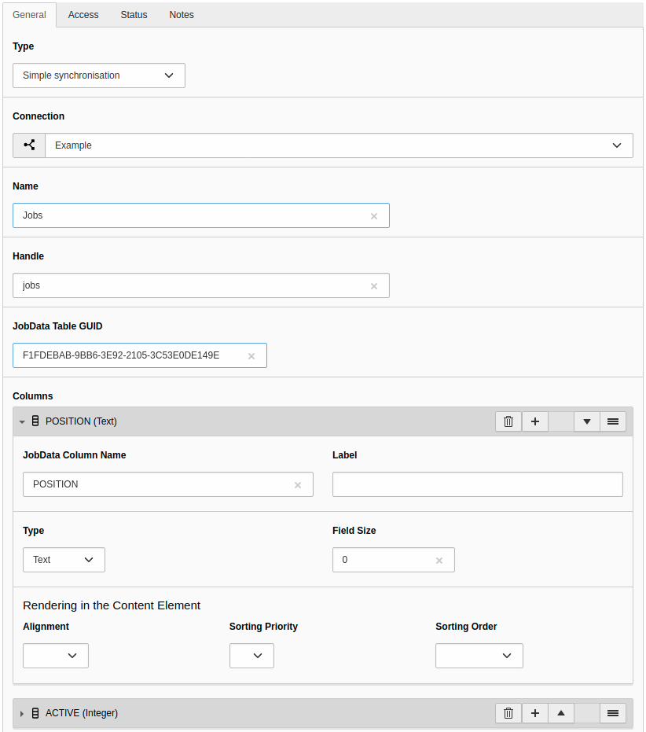
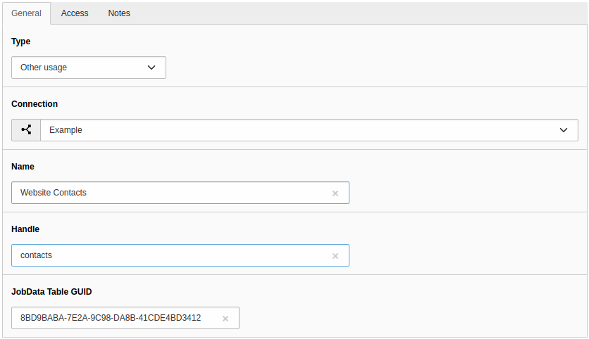

.. include:: _includes.txt

.. _usage:

=====
Usage
=====

Target group: **Integrators, Administrators**

.. _usage-module:

Module
======

The links to tables in JobRouter installations are managed in the module
:guilabel:`JobRouter` > :guilabel:`Data`.

On your first visit after installing the extension you will see the following
screen:

.. figure:: _images/no-table-links-found.png
   :alt: Initial Data module screen

   Initial Data module screen

.. _usage-create-table-link:

Create a Table Link
===================

To create a new table link, click the :guilabel:`+` button on the top menu bar,
which opens a form. Alternatively, you can use the :guilabel:`Create new table
link` button.

.. _usage-create-table-link-types:

Types
-----

Each table link has on of the following types:

.. figure:: _images/table-link-types.png
   :alt: Table link types

   Table link types

.. _usage-create-table-link-simple:

Simple synchronisation
----------------------

The data sets of the JobData table are synchronised in a table provided by this
extension. This is the recommended type if you only want to display data,
e.g. with the :ref:`plugin <editor-plugin>`. Have a look at the developer
corner to see the :ref:`schema <developer-simple-sync-table>` of the table and
how to use it in your code. The synchronisation is done with the available
:ref:`synchronisation command <configuration-sync-command>`.

   Create a table link of type "Simple synchronisation"

The following fields are available:

.. include:: table-link-columns/connection.txt
.. include:: table-link-columns/name.txt
.. include:: table-link-columns/jobdata-table-guid.txt
.. include:: table-link-columns/columns.txt
.. include:: table-link-columns/enabled.txt

.. _usage-create-table-link-own:

Synchronisation in own table
----------------------------

You have to define a table yourself in an extension with the needed columns
from the JobData table. This is the recommended way when you want to display the
data yourself, e.g. with filtering by some columns or with joins to other data.
The synchronisation is carried out with the available :ref:`synchronisation
command <configuration-sync-command>`.

.. figure:: _images/create-table-link-own-table.png
   :alt: Create a table link of type Synchronisation in own table

   Create a table link of type "Synchronisation in own table"

The following fields are available:

.. include:: table-link-columns/connection.txt
.. include:: table-link-columns/name.txt
.. include:: table-link-columns/jobdata-table-guid.txt
.. include:: table-link-columns/own-table.txt
.. include:: table-link-columns/enabled.txt

.. _usage-create-table-link-other:

Other usage (no synchronisation)
--------------------------------

You only define the link to a JobData table – there is no automatic
synchronisation. This type can be used for the TYPO3 JobRouter Form extension to
push the field values of a submitted form into a JobData table. Also you can
synchronise data sets yourself and enrich the data with additional information.

.. todo::
   Add link to TYPO3 JobRouter Form extension

   Create a table link of type "Other usage"

The following fields are available:

.. include:: table-link-columns/connection.txt
.. include:: table-link-columns/name.txt
.. include:: table-link-columns/jobdata-table-guid.txt
.. include:: table-link-columns/enabled.txt

.. _usage-table-links-overview:

Table Links Overview
====================

After you have created one or more table links, you will see an overview of the
table links when you open the module:

.. figure:: _images/table-links-overview.png
   :alt: Overview of available table links

   Overview of available table links

If a table link is not enabled, this is indicated by the addition "(disabled)"
in the name.

There are three buttons available for each table link:

.. image:: _images/table-link-buttons.png

- You can edit a table link with the pencil. Alternatively click on the name of
  the table to open the edit form.
- Click on the bug icon to test a table link connection.
- The last icon is a link to the JobData table definition in the JobRouter
  installation. Alternatively click on the table GUID to open the JobData table
  definition.

The table link records are stored under the root page. You can edit a table link
also inside the :guilabel:`List` module.

.. _usage-delete-table:

Delete a Table Link
===================

To delete a table link, open the edit page of the table link. In the upper
menu bar you will find the :guilabel:`delete` button.
